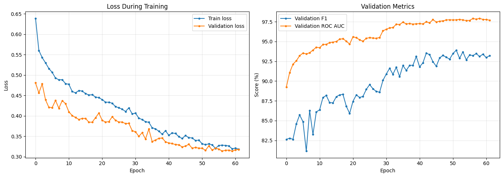
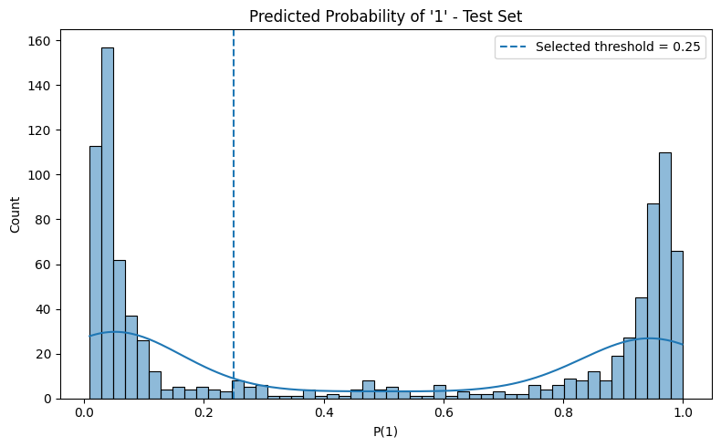
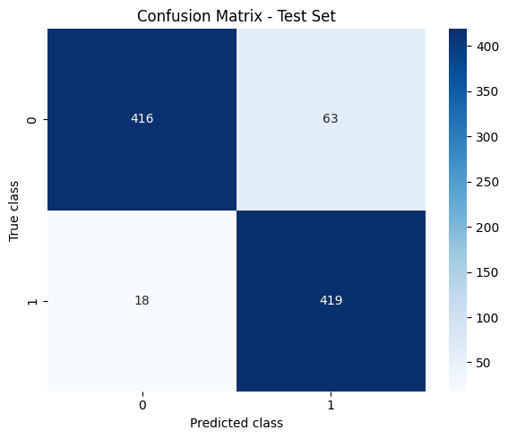

# Glaucoma Detection from Retinal Fundus Images

> **End-to-end deep learning project for automated glaucoma classification from retinal fundus images, using CLAHE-enhanced preprocessing, data augmentation, progressive transfer learning with ConvNeXt-Tiny, and validation-based decision threshold optimization.**

<p align="left">
  
  
  
  
  
  
  
</p>

---

## Overview

Glaucoma is a progressive optic neuropathy that can lead to irreversible vision loss. This project investigates the use of **deep learning for automated glaucoma classification from retinal fundus images**.

The proposed pipeline is based on an **ImageNet-pretrained ConvNeXt-Tiny** architecture and combines:

- CLAHE-based retinal image enhancement
- Data augmentation with Albumentations
- Transfer learning from ImageNet
- Progressive backbone fine-tuning
- Weighted random sampling
- Class-weighted loss
- Label smoothing
- Automatic mixed-precision training
- Learning-rate scheduling
- Early stopping
- Validation-based checkpoint selection
- Validation-based decision threshold optimization
- Independent test-set evaluation

The final model achieved a **97.15% ROC AUC**, **95.88% sensitivity**, **91.19% F1-score**, and **91.16% accuracy** on the held-out test set.

> **Research disclaimer:** This project was developed for academic and research purposes. The model has not undergone external clinical validation and must not be used as a medical diagnostic system or as a substitute for professional medical assessment.

---

## Results

The best ConvNeXt-Tiny checkpoint was selected according to the **validation F1-score**.

The best model was obtained at **epoch 52**, reaching a validation F1-score of **93.90%**.

Following model selection, the classification threshold was optimized exclusively on the validation set. The selected threshold of **0.25** was then fixed before the final evaluation on the independent test set.

### Final Test Performance

| Metric | Result |
|---|---:|
| **ROC AUC** | **97.15%** |
| **Recall / Sensitivity** | **95.88%** |
| **F1-score** | **91.19%** |
| **Accuracy** | **91.16%** |
| Precision | 86.93% |
| Test Loss | 0.3481 |
| Selected Threshold | 0.25 |
| Best Validation F1 | 93.90% |
| Best Epoch | 52 |

The model achieved a sensitivity of **95.88%**, indicating that it identified most glaucoma-positive samples contained in the test set.

The **97.15% ROC AUC** indicates strong discrimination between the two classes across classification thresholds.

These results represent experimental performance on the dataset used in this project and should not be interpreted as evidence of real-world clinical diagnostic performance.

---

## Experimental Results

### Training History

The following figure shows the evolution of the main training and validation metrics throughout optimization.

<p align="center">
  
</p>

The training history provides a visual representation of model convergence and validation behavior during the transfer-learning and progressive fine-tuning stages.

---

### Prediction Distribution

The following figure shows the distribution of model outputs during evaluation.

<p align="center">
  
</p>

This visualization provides additional insight into the separation produced by the trained classifier between the two classes.

---

### Confusion Matrix

The confusion matrix below summarizes the final classification results on the independent test set using the selected decision threshold of **0.25**.

<p align="center">
  
</p>

The confusion matrix complements the global evaluation metrics by showing the distribution of correct predictions and classification errors for both classes.

---

## Deep Learning Pipeline

```text
Retinal Fundus Image
        │
        ▼
Resize to 224 × 224
        │
        ▼
CLAHE Enhancement
        │
        ├──────────────────────────┐
        │                          │
        ▼                          ▼
    Training                Validation / Test
        │                          │
        ▼                          ▼
Data Augmentation           Deterministic
(Albumentations)            Preprocessing
        │                          │
        └────────────┬─────────────┘
                     │
                     ▼
          ImageNet Normalization
                     │
                     ▼
       Pretrained ConvNeXt-Tiny
                     │
                     ▼
        Custom Classification Head
                     │
                     ▼
           Binary Classification
                     │
                     ▼
      Validation Threshold Search
                     │
                     ▼
           Threshold = 0.25
                     │
                     ▼
          Final Test Evaluation
```

---

## Dataset

The final experimental dataset contains **10,040 retinal fundus images** divided into predefined training, validation, and test sets.

| Split | Images | Class 0 | Class 1 |
|---|---:|---:|---:|
| Training | 8,354 | 4,219 | 4,135 |
| Validation | 770 | 385 | 385 |
| Test | 916 | 479 | 437 |
| **Total** | **10,040** | **5,083** | **4,957** |

The dataset used for this project was constructed from retinal fundus image datasets available through Kaggle.

### Data Sources

#### EyePACS-AIROGS Light V2 — Glaucoma Dataset

Retinal fundus images intended for glaucoma-related computer vision experiments.

- **Dataset:** Glaucoma Dataset — EyePACS-AIROGS Light V2
- **Platform:** Kaggle
- **Source:** https://www.kaggle.com/datasets/deathtrooper/glaucoma-dataset-eyepacs-airogs-light-v2

#### RIM-ONE — Retinal Dataset for Assessing Glaucoma

RIM-ONE provides retinal fundus images for research related to glaucoma assessment.

- **Dataset:** RIM-ONE Retinal Dataset for Assessing Glaucoma
- **Platform:** Kaggle
- **Source:** https://www.kaggle.com/datasets/orvile/rim-one-retinal-dataset-for-assessing-glaucoma

### Dataset Organization

The images used in the experiment were organized locally according to the `torchvision.datasets.ImageFolder` structure:

```text
Fusion/
│
├── train/
│   ├── 0/
│   └── 1/
│
├── val/
│   ├── 0/
│   └── 1/
│
└── test/
    ├── 0/
    └── 1/
```

The resulting experimental split contains:

- **8,354** training images
- **770** validation images
- **916** test images

> **Dataset availability:** The retinal images are not redistributed through this repository. Users interested in reproducing the project should obtain the original datasets directly from their respective sources and comply with their licenses, citation requirements, and terms of use.

---

## Model Architecture

### ConvNeXt-Tiny

The final classifier is based on **ConvNeXt-Tiny**, initialized with ImageNet-pretrained weights provided by `torchvision`.

The original classification layer is replaced with a custom classification head:

```text
ConvNeXt-Tiny
ImageNet-pretrained backbone
        │
        ▼
      Flatten
        │
        ▼
    LayerNorm
        │
        ▼
   Dropout (0.40)
        │
        ▼
 Linear (2 classes)
        │
        ▼
 Binary Prediction
```

The notebook also includes an implementation of **EfficientNetV2-S** as an alternative architecture.

All experimental results reported in this README correspond to **ConvNeXt-Tiny**.

---

## Image Preprocessing

All retinal fundus images are resized to:

```text
224 × 224
```

**CLAHE (Contrast Limited Adaptive Histogram Equalization)** is applied to improve local image contrast before classification.

The images are subsequently normalized using the standard ImageNet normalization parameters expected by the pretrained ConvNeXt network.

### Validation and Test Preprocessing

```text
Retinal Image
      │
      ▼
Resize 224 × 224
      │
      ▼
CLAHE
      │
      ▼
ImageNet Normalization
      │
      ▼
Tensor
```

Validation and test transformations are deterministic.

---

## Data Augmentation

Training augmentation is implemented using **Albumentations**.

The augmentation pipeline includes:

- CLAHE
- Horizontal flipping
- Vertical flipping
- Random rotation
- Brightness and contrast variations
- Hue, saturation, and value variations
- Gaussian noise
- Coarse dropout
- ImageNet normalization
- Tensor conversion

Conceptually, the training pipeline follows:

```text
Retinal Image
      │
      ▼
Resize
      │
      ▼
CLAHE
      │
      ▼
Geometric Augmentation
      │
      ▼
Color Augmentation
      │
      ▼
Noise / Coarse Dropout
      │
      ▼
ImageNet Normalization
      │
      ▼
Tensor
```

Random training augmentation is never applied during validation or final test evaluation.

---

## Transfer Learning

The model uses **transfer learning** rather than training ConvNeXt from random initialization.

Training starts from visual representations learned from ImageNet.

During the initial training stage, most of the pretrained backbone remains frozen while the final feature block and custom classification head are optimized for the retinal image classification task.

This allows higher-level representations to adapt to retinal fundus images while preserving useful pretrained visual features.

---

## Progressive Fine-Tuning

The training procedure follows a two-stage fine-tuning strategy.

### Stage 1 — Partial Fine-Tuning

During the initial stage:

```text
ConvNeXt Backbone
│
├── Earlier Feature Blocks → Frozen
├── Final Feature Block    → Trainable
└── Classification Head    → Trainable
```

The initial learning rate is:

```text
5e-5
```

### Stage 2 — Full Fine-Tuning

At **epoch 30**, the complete ConvNeXt backbone is unfrozen.

```text
Epoch 30
   │
   ▼
Unfreeze Complete Backbone
   │
   ▼
Reduce Learning Rate
   │
   ▼
End-to-End Fine-Tuning
```

The fine-tuning learning rate is:

```text
1e-5
```

This progressive strategy allows the newly initialized classification layers and high-level representations to adapt before applying smaller gradient updates across the complete pretrained network.

---

## Training Configuration

| Parameter | Value |
|---|---:|
| Architecture | ConvNeXt-Tiny |
| Pretraining | ImageNet |
| Input Size | 224 × 224 |
| Batch Size | 32 |
| Maximum Epochs | 300 |
| Initial Learning Rate | `5e-5` |
| Fine-Tuning Learning Rate | `1e-5` |
| Optimizer | AdamW |
| Weight Decay | `1e-5` |
| Loss | Weighted Cross-Entropy |
| Label Smoothing | `0.1` |
| LR Scheduler | ReduceLROnPlateau |
| Early Stopping Patience | 10 |
| Full Backbone Unfreezing | Epoch 30 |
| Model Selection Metric | Validation F1 |
| Random Seed | 42 |
| Mixed Precision | PyTorch AMP |

---

## Optimization

The model is optimized using **AdamW**.

A `ReduceLROnPlateau` scheduler monitors validation performance and adapts the learning rate when improvement stagnates.

The training objective is based on:

```text
CrossEntropyLoss
```

with:

- class weighting
- label smoothing (`0.1`)

Automatic Mixed Precision (**AMP**) is enabled when CUDA is available to improve GPU training efficiency and reduce memory consumption.

---

## Class Imbalance Handling

Although the final dataset is relatively balanced, the training pipeline explicitly accounts for differences in class frequency.

### Weighted Random Sampling

A `WeightedRandomSampler` adjusts the probability of selecting training examples according to their class frequency.

This mechanism operates exclusively on the training set.

### Weighted Loss

Class weights are independently calculated from the training labels and incorporated into `CrossEntropyLoss`.

Validation and test class distributions are not used when computing training weights.

---

## Model Selection and Early Stopping

Model selection is performed exclusively using the **validation F1-score**.

Whenever validation F1 improves, the corresponding model weights are saved as the current best checkpoint.

Early stopping terminates training when validation performance does not improve for the configured patience period.

The best checkpoint from the final experiment was obtained at:

```text
Best Epoch         : 52
Best Validation F1 : 93.90%
```

This checkpoint is subsequently reloaded before threshold optimization and final evaluation.

---

## Decision Threshold Optimization

Binary classifiers commonly use a default probability threshold of `0.50`.

In this project, the operating threshold is instead selected using predictions obtained from the **validation set**.

Candidate thresholds are evaluated according to validation performance:

```text
Validation Predictions
          │
          ▼
 Candidate Thresholds
          │
          ▼
 Validation F1 Score
          │
          ▼
 Best Threshold
          │
          ▼
        0.25
          │
          ▼
    Freeze Threshold
          │
          ▼
 Independent Test Set
```

The final selected threshold was:

```text
0.25
```

The **test set was not used to select this threshold**.

Only after threshold selection was complete was the final model evaluated on the independent test set.

This separation prevents direct test-set leakage during operating-point selection.

---

## Evaluation Metrics

The final classifier is evaluated using several complementary metrics:

- **Accuracy** — overall proportion of correct predictions
- **Precision** — proportion of predicted positive samples that are positive
- **Recall / Sensitivity** — proportion of positive samples correctly detected
- **F1-score** — harmonic mean of precision and recall
- **ROC AUC** — discrimination performance across classification thresholds
- **Cross-entropy loss**
- **Confusion matrix**

Sensitivity is particularly relevant to this experimental task because a false negative corresponds to a glaucoma-positive image that the classifier fails to identify.

---

## Repository Structure

```text
Glaucoma-detection/
│
├── Images/
│   ├── 1.png
│   ├── Barres.png
│   └── Matrix.png
│
├── Notebook/
│   └── glaucoma_detection.ipynb
│
├── .gitignore
├── LICENSE
├── README.md
└── requirements.txt
```

Datasets, trained model checkpoints, local environments, and temporary files are intentionally excluded from version control.

---

## Installation

### 1. Clone the Repository

```bash
git clone <YOUR_REPOSITORY_URL>
cd Glaucoma-detection
```

### 2. Create a Virtual Environment

```bash
python -m venv .venv
```

#### Windows

```powershell
.venv\Scripts\activate
```

#### Linux / macOS

```bash
source .venv/bin/activate
```

### 3. Install Dependencies

```bash
pip install -r requirements.txt
```

A CUDA-capable GPU is strongly recommended for model training.

---

## Requirements

The main dependencies are:

```text
torch
torchvision
albumentations
numpy
scikit-learn
matplotlib
seaborn
tqdm
opencv-python
jupyter
```

---

## Running the Project

After downloading the source datasets, organize the images according to the expected dataset structure or modify `DATA_ROOT` inside the notebook.

Then open the notebook located in:

```text
Notebook/
```

using **Jupyter Notebook** or **Google Colab**.

Execute the notebook cells sequentially to reproduce preprocessing, training, validation, threshold optimization, and evaluation.

---

## Google Colab

The final experiment was trained using **Google Colab** with the dataset stored in Google Drive.

Google Drive can be mounted using:

```python
from google.colab import drive

drive.mount("/content/drive")
```

The dataset path used during the reported experiment was:

```text
/content/drive/MyDrive/Fusion
```

The best checkpoint was saved to:

```text
/content/drive/MyDrive/Fusion/checkpoints/best_glaucoma_convnext.pth
```

The trained checkpoint is intentionally excluded from this repository.

---

## Reproducibility

The experiment uses a fixed random seed:

```python
SEED = 42
```

Random seeds are configured for:

- Python
- NumPy
- PyTorch
- CUDA, when available

The training, validation, and test datasets remain separated throughout the experiment.

Random augmentation is restricted to the training pipeline, while validation and test preprocessing remain deterministic.

Exact numerical reproduction may nevertheless vary depending on:

- PyTorch version
- CUDA version
- cuDNN version
- GPU architecture
- underlying GPU operations

---

## Technology Stack

| Category | Technologies |
|---|---|
| Language | Python |
| Deep Learning | PyTorch, Torchvision |
| Main Architecture | ConvNeXt-Tiny |
| Alternative Architecture | EfficientNetV2-S |
| Image Augmentation | Albumentations |
| Image Processing | OpenCV, CLAHE |
| Machine Learning | scikit-learn |
| Numerical Computing | NumPy |
| Visualization | Matplotlib, Seaborn |
| Development | Jupyter Notebook, Google Colab |
| GPU Acceleration | CUDA, PyTorch AMP |

---

## Limitations

The results reported in this repository are specific to the dataset and experimental split used in this project.

Several limitations should be considered:

- No external clinical dataset was used for final validation.
- No prospective clinical evaluation was performed.
- Performance may vary across retinal cameras and acquisition protocols.
- Image-quality differences may affect model predictions.
- Performance may vary across institutions and patient populations.
- Dataset composition may influence measured performance.
- The probability threshold of `0.25` is an experimentally optimized operating point, not a clinically established diagnostic threshold.
- High performance on the current test set does not guarantee equivalent performance in real-world clinical environments.

The model should therefore be considered a **research prototype rather than a clinical diagnostic system**.

---

## Future Work

Potential extensions of this project include:

- External validation on independent retinal datasets
- Patient-level evaluation where applicable
- Grad-CAM and other explainability techniques
- Model calibration analysis
- Sensitivity-specificity operating-point analysis
- Comparison with additional modern vision architectures
- Cross-dataset generalization experiments
- Ablation studies on CLAHE and augmentation strategies
- Lightweight architectures for deployment
- Prospective clinical validation

---

## Data Sources & Acknowledgments

This project uses retinal fundus images obtained from publicly available datasets hosted on Kaggle.

### EyePACS-AIROGS Light V2

**Glaucoma Dataset — EyePACS-AIROGS Light V2**

https://www.kaggle.com/datasets/deathtrooper/glaucoma-dataset-eyepacs-airogs-light-v2

### RIM-ONE

**RIM-ONE Retinal Dataset for Assessing Glaucoma**

https://www.kaggle.com/datasets/orvile/rim-one-retinal-dataset-for-assessing-glaucoma

We acknowledge the original dataset creators and contributors for making these retinal imaging resources available to the research community.

The datasets themselves are **not included in this repository**. Their respective licenses, citation requirements, and terms of use remain applicable.

---

## Authors

- **Sirem Kaci**

---

## Medical Disclaimer

This software, source code, trained models, and experimental results are provided exclusively for **research and educational purposes**.

The system is **not intended to diagnose glaucoma or any other medical condition**.

It must not replace examination, interpretation, diagnosis, or clinical judgment by qualified healthcare professionals.

---

## License

See the [`LICENSE`](LICENSE) file included in this repository for the applicable software license.

---

## Acknowledgments

This project was developed using open-source tools and libraries from the Python machine-learning and computer-vision ecosystem, including **PyTorch, Torchvision, Albumentations, OpenCV, NumPy, scikit-learn, Matplotlib, and Seaborn**.

Training was performed using **Google Colab** with GPU acceleration through **CUDA**.

Special acknowledgment is given to the creators and maintainers of the retinal fundus datasets used in this project for making these resources available to the research community.